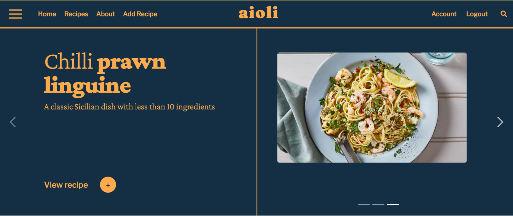
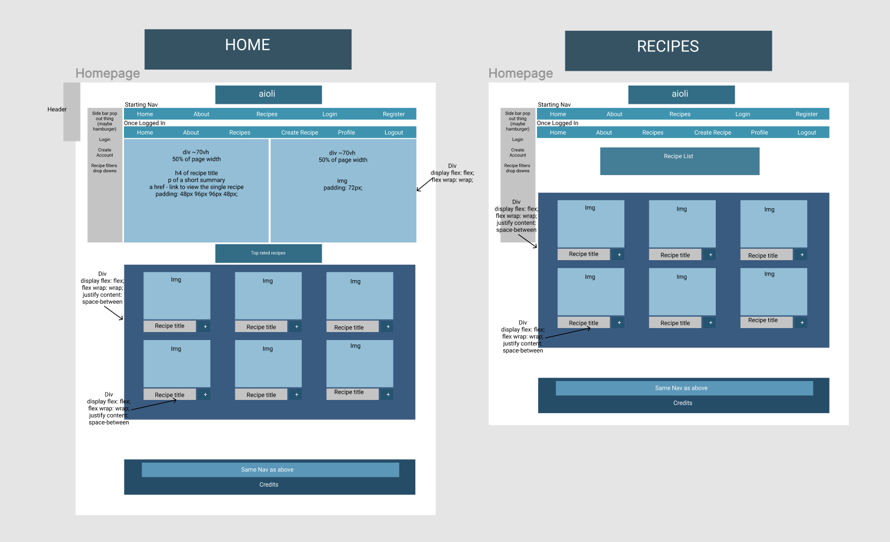
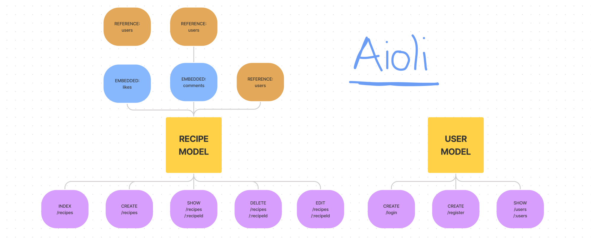
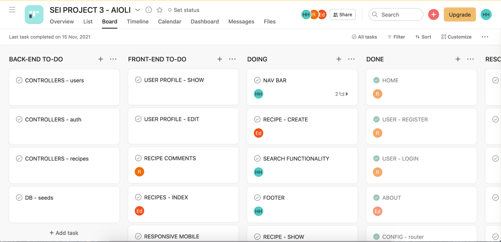
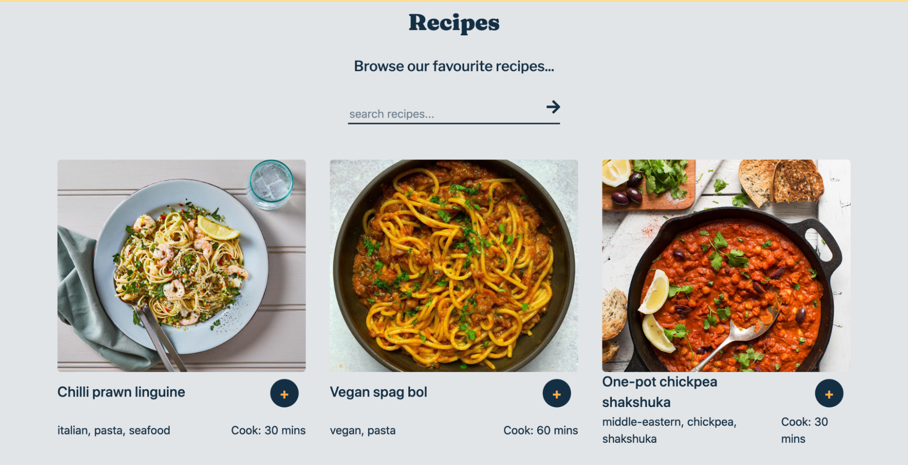
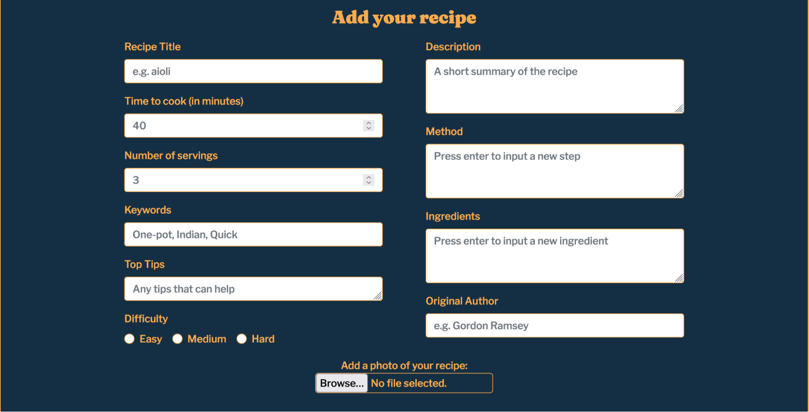
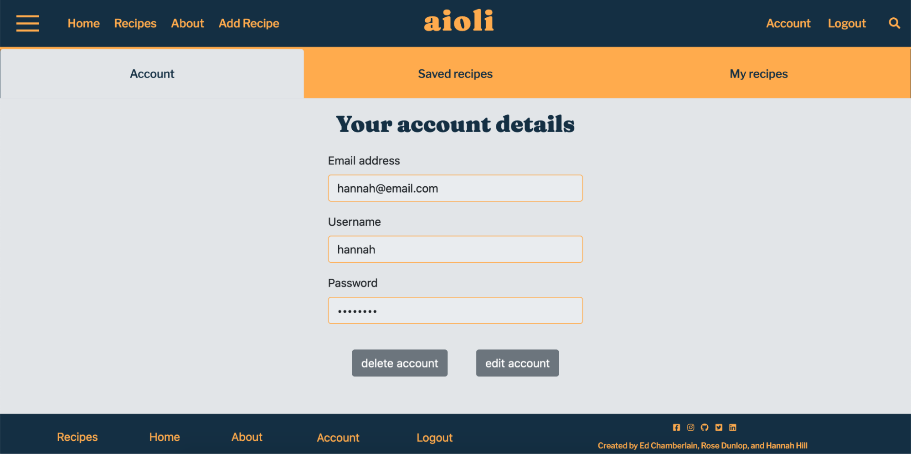
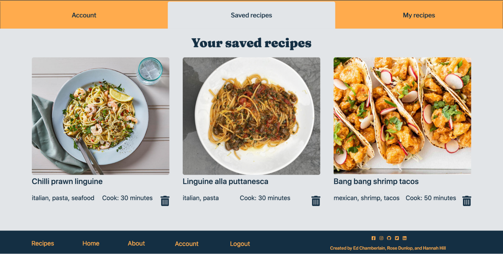
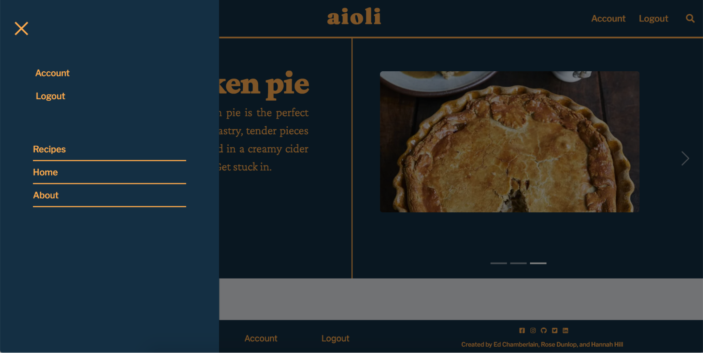

# AIOLI - GA PROJECT 03

This is my third project for the General Assembly Software Engineering Immersive course. Aioli is a full-stack MERN app, developed as a team with my classmates [Rose Dunlop](https://github.com/rosedunlop) and [Ed Chamberlain](https://github.com/Chameh96).

This app is deployed with Heroku and available [here](https://aioli-app.herokuapp.com/).

Aioli is a recipe-sharing app, where users can find, share, and save new recipes.



## TABLE OF CONTENTS

- [Overview](#overview)
  - [Technologies Used](#technologies)
  - [Brief](#brief)
  - [Getting Started](#getting-started)
- [Planning](#planning)
- [Site Architecture](#architecture)
  - [Backend](#backend)
  - [Frontend](#frontend)
- [Featured Code](#featured-code)
- [Bugs & Known Errors](#bugs)
- [Future Improvements](#improvements)
- [Wins & Challenges](#wins)
- [Key Learnings](#learnings)

## <a name='overview'>OVERVIEW</a>

### <a name='technologies'>TECHNOLOGIES USED</a>

- Node.js
- Express
- MongoDB
- Mongoose
- JavaScript (ES6)
- React
- Axios
- Nodemon
- CSS / Sass
- React Bootstrap
- JWT
- Git / GitHub

### <a name='brief'>BRIEF</a>

- Build a full-stack application by making your own backend and your own front-end.
- Use an Express API to serve your data from a Mongo database.
- Consume your API with a separate front-end built with React.
- Be a complete product which most likely means multiple relationships and CRUD functionality for at least a couple of models.
- Implement thoughtful user stories/wireframes that are significant enough to help you know which features are core MVP and which you can cut.
- Have a visually impressive design.
- Be deployed online so it's publicly accessible.

### <a name='getting-started'>GETTING STARTED</a>

Clone or download this repository

In a new terminal window, run `mongod mongod --dbpath ~/data/db` to start a MongoDB server

Run `mongosh` to start a MongoDB shell

Run `yarn` at the project root to download any dependencies

Run `yarn serve` to start the backend server

Navigate to the frontend with `cd frontend` and run `yarn start` to start the frontend server

## <a name='planning'>PLANNING</a>

Our team dedicated a significant portion of time to planning our project. This was our first full-stack dev project and our first time working in a group larger than 2, and we knew there would be challenges if we didn’t have clear plans for both the app’s structure and our team workflow. We also wanted to make sure everyone had the chance to work full-stack, and work on areas where they were less confident to learn from the others. Having spent the whole of Day 1 planning, our team was confident and happy going into the development process, and we all had the same vision for our MVP.

We used Figma to create wireframes for all of our pages to start thinking about UX, our API endpoints, and the skeleton structure of our app.



I also created this Figma sketch for our models, routes, and endpoints so we had an idea of how our models interacted with each other and the frontend.



My project management background came in useful - I took responsibility for creating an Asana kanban board to manage our workflow and allocate tasks. This also allowed us to keep track of where our team mates were working and avoid potential merge conflicts.



## <a name='site-architecture'>SITE ARCHITECTURE</a>

### <a name='backend'>BACKEND</a>

We decided to start by working on the backend together using VSCode’s LiveShare. This way, we could collaborate on the same file and get the backend up and running quickly.

#### DATA MODELS

We decided to create our database across two central models, one for recipes and one for users.

We used a Mongoose schema to define the shape of our recipe collection. This was the longest schema we built. In addition to containing all of the recipe information, each recipe had a reference relationship with a user as the document’s owner, and the social functionality was built through embedded ‘save’ and ‘comment’ models. Embedding the social models into the recipe model facilitated the build of our read/show recipe functionality and to ensure relevant comments/saves were deleted alongside the recipe.

```
const recipeSchema = new mongoose.Schema({
  title: { type: String, required: true },
  image: { type: String },
  description: { type: String },
  method: [{ type: String, required: true }],
  ingredients: [{ type: String, required: true }],
  keywords: [{ type: String }],
  time: { type: Number, required: true },
  servings: { type: Number, required: true },
  tips: { type: String },
  difficulty: { type: String },
  author: { type: String },
  owner: { type: mongoose.Schema.ObjectId, ref: 'User', required: true },
  comments: [commentSchema],
  likes: [likeSchema]
})
```

Our user model was fairly simple in its schema - username, email, and passwords were the only fields. We then leveraged Mongoose virtuals to add extra properties that we did not want mapped to the MongoDB collection, such as a password confirmation field as part of the authentication process (see below). With virtual fields, we were also able to populate ‘created recipes’ and ‘saved recipes’ fields within each document, using local and foreign fields to identify recipes.

```
userSchema.virtual('createdRecipes', {
  ref: 'Recipe',
  localField: '_id',
  foreignField: 'owner'
})

//virtual field for user profiles, recipes liked by user
userSchema.virtual('likedRecipes', {
  ref: 'Recipe',
  localField: '_id',
  foreignField: 'likes.owner'
})
```

For user authentication, we wrote in custom pre-validation and pre-save checks to ensure that the password and password confirmation match and to hash the plain-text password with bcrypt before saving. We also added a method to the user model to validate passwords, checking the user inputted plain text password against the stored hash.

```
userSchema.pre('validate', function (next) {
  if (
    this.isModified('password') &&
    this.password !== this._passwordConfirmation
  ) {
    this.invalidate('passwordConfirmation', 'Passwords do not match')
  }
  next()
})

...

userSchema.pre('save', function (next) {
  if (this.isModified('password')) {
    this.password = bcrypt.hashSync(this.password, bcrypt.genSaltSync())
  }
  next()
})
```

#### CONTROLLERS

We stored all functions that control endpoint functionality within a controllers folder. Recipes could be created, read, updated, and deleted by users, while likes and comments could be created, read, and deleted. Auth controllers could be used to register and login users, while our user model also had controllers to view profile details and delete your account. Where necessary, we populated virtuals within the controller, for example to populate the user data for a document or comment owner.

```
export const getSingleRecipe = async (req, res) => {
  try {
    const { id } = req.params
    const singleRecipe = await Recipe.findById(id)
      .populate('owner')
      .populate('comments.owner')
      .populate('likes.owner')
    return res.status(202).json(singleRecipe)
  } catch (err) {
    return res.status(404).json({ message: 'Recipe Not Found' })
  }
}
```

The CRUD methods are assigned to the correct backend routes in config/router.js. We also added a secure route middleware to routes where user authentication was required, such as adding, deleting, or saving recipes. Here’s an example route for our individual recipe methods.

```
router
  .route('/recipes/:id')
  .get(getSingleRecipe)
  .delete(secureRoute, deleteRecipe)
  .put(secureRoute, updateRecipe)
```

#### SEEDING THE DATABASE

Our homework for the first few days of the project was adding content into the database to eventually constitute our seeds file. Recipes can have very long ingredient lists and methods, but we managed to add 20 recipes to our database. We saved these in db/data.js where they could be exported, and then wrote out a seed function using Mongoose to drop and reseed the database.

```
const seedDatabase = async () => {
    try {
        //Connect to the database
        await mongoose.connect(dbURI)
        console.log('🍕 Database connected')

        //Drop the database
        await mongoose.connection.db.dropDatabase()
        console.log('🦴 DB Dropped')

        //Add the user data into the db
        const users = await User.create(userData)
        console.log('Users added to db', users.length)
        console.log('users', users)

        //Add owner to each predator, so each one is created with an owner attached
        const recipeOwners = recipes.map((recipe) => {
        recipe.owner = users[0]._id
        return recipe
        })

        //Seed that database with data we import
        const recipesAdded = await Recipe.create(recipeOwners)
        console.log(recipesAdded.length)

        //Close the connection to the db
        await mongoose.connection.close()
        console.log('Bye')

    } catch (err) {
        console.log(err)
        //Close the connection
        await mongoose.connection.close()
        console.log('Error. Database connection closed')
    }
}
seedDatabase()
```

We worked really well as a team to get the backend up and running. By the end of Day 2, all of our backend endpoints were working perfectly in Insomnia and we were glad to be ahead!

### <a name='frontend'>FRONTEND</a>

For the frontend, each person worked on the tasks allocated to them in Asana. We would create a new branch for each feature and merge into our development branch before moving on to the next. We communicated through our team Slack channel, and often spent the majority of the day working on Zoom in case we needed opinions or help from our teammates. In the evening, we would all merge any work from the day into development, checking any conflicts as a team.

Here is an outline of our final UX:

#### Home


#### All recipes



#### Single recipe


#### Add a recipe form



#### Account section



## <a name='featured-code'>FEATURED CODE</a>

We all worked full-stack and touched on most functionality/elements at some point during the development process, whether in styling, debugging or testing. However, here are a few of the elements that I owned:

### SEARCH FUNCTIONALITY


In addition to building the header and search bar, I used React-router to build search functionality using query strings. On search, the search value is embedded as a parameter into the URL so it can be passed to the results page. In the results page component, I access the `location.search` params that are passed by React-router and then use the URLSearchParams constructor to get the query value from the URL. With the query value saved to a variable, I then fetched all recipes from the backend and filtered them on the frontend using a few JS methods, most importantly `includes(query)`. I set this to search through the recipe titles and keywords to return relevant recipes.

```
const SearchBar = () => {
  const [searchValue, setSearchValue] = useState(null)
  const handleChange = (event) => {
    setSearchValue(event.target.value)
  }

  return (
    <div className='searchBar-container'>
      <form action='/' method='get' autoComplete='off'>
        <input
          type='text'
          id='header-search'
          placeholder='search recipes'
          name='query'
          onChange={handleChange}
        />
        <Link
          to={{ pathname: '/search-results', search: `?query=${searchValue}` }}
        >
          <FontAwesomeIcon
            icon={faArrowRight}
            className='arrow-icon-nav'
            type='submit'
          />
        </Link>
      </form>
    </div>
  )
}
```

```
const SearchResults = () => {
  const [recipes, setRecipes] = useState([])
  const { search } = window.location
  const query = new URLSearchParams(search).get('query')
  const filteredRecipes = filterRecipes(recipes, query)

  useEffect(() => {
    fetchRecipes().then(setRecipes)
  }, [])

  function filterRecipes(recipes, query) {
    if (!query) {
      return recipes
    }
    return recipes.filter((recipe) => {
      const recipeTitle = recipe.title.toLowerCase()
      const recipeKeywords = recipe.keywords.join(' ').toLowerCase()
      return recipeTitle.includes(query) || recipeKeywords.includes(query)
    })
  }
```

### SAVING RECIPES



On the recipe page, if the user clicks on the plus icon on a recipe card, the ‘save’ (often called like in the code as we changed the direction slightly during development) is pushed into the recipe’s ‘likes’ field array.

Heading to the account section triggers an API call for the user data - including populating the virtuals for `likedRecipes` and `createdRecipes` based on local and foreign fields. Any recipes that have saves/likes owned by the user will be populated. On the backend, I wrote the following endpoint methods:

```
export const getUserProfile = async (req, res) => {
  try {
    const user = await User.findById(req.currentUser._id)
      .populate('createdRecipes')
      .populate('likedRecipes')
    if (!user) throw new Error()
    console.log(user)
    return res.status(200).json(user)
  } catch (err) {
    console.log(err)
    return res.status(404).json({ message: 'Not Found' })
  }
}
```

The savedRecipes component is passed the user’s id and the likedRecipes virtual field as props from the Account page. The recipes are then simply displayed as cards on the ‘saved recipes’ tab. On this view, you can click on the trash icon to remove the recipe from the user’s saved recipes, which will remove the save/like from the recipe itself.

```
//Saving recipe to account
export const saveRecipe = async (id) => {
  const config = {
    method: 'post',
    url: `/api/recipes/${id}/likes`,
    headers: {
      Authorization: `Bearer ${getToken()}`
    }
  }
  const response = await axios(config)
  return response.data
}

//Remove from saved recipes
export const unsaveRecipe = async (id, likeId) => {
  const config = {
    method: 'delete',
    url: `/api/recipes/${id}/likes/${likeId}`,
    headers: {
      Authorization: `Bearer ${getToken()}`
    }
  }
  const response = await axios(config)
  return response.data
}
```

### HAMBURGER NAV



Finally, a more superficial element that I was responsible for was building an offcanvas nav with a hamburger.

I decided to try using Bootstrap for the first time, as the React Bootstrap documentation had some pre-built Offcanvas elements that seemed straightforward, and I was keen to get an understanding of Bootstrap. I then replaced the bootstrap show/close button with an [animated hamburger menu icon](https://hamburger-react.netlify.app/).

```
const OffcanvasNav = ({
  handleLogout,
  isLoggedIn,
  handleShowLogin,
  handleShowRegister
}) => {
  const [show, setShow] = useState(false)

  const handleClose = () => setShow(false)
  const handleShow = () => (!show ? setShow(true) : setShow(false))

  return (
    <>
      <Hamburger toggled={show} toggle={handleShow} />

      <Offcanvas var='--bs-dark' show={show} onHide={handleClose}>
        <Offcanvas.Header>
          <Offcanvas.Title></Offcanvas.Title>
        </Offcanvas.Header>
        <Offcanvas.Body>
          <div>
            <ul className='offcanvas-auth'>
              {isLoggedIn ? (
                <>
                  <Link to='/account'>
                    <button className='auth-button-account'>Account</button>
                  </Link>
                  <button className='auth-button' onClick={handleLogout}>
                    Logout
                  </button>
                </>
              ) : (
                <>
                  <button className='button-one' onClick={handleShowLogin}>
                    Login
                  </button>
                  <button className='button-two' onClick={handleShowRegister}>
                    Create an account
                  </button>
                </>
              )}
            </ul>
          </div>
          <div>
            <ul>
              <li>
                ...
            </ul>
          </div>
        </Offcanvas.Body>
      </Offcanvas>
    </>
  )
}
```

## <a name='bugs'>BUGS & KNOWN ERRORS</a>

Search functionality - search bar does not clear on submit and you cannot perform a new search without refreshing the page. Also, the search bar on the main recipes page is not yet functional, unlike the one in the header.

Proxy errors - during development we often encountered issues with our proxy middleware and on occasion the data does not load correctly.

The created recipes tab within the account settings page has not been created yet so it displays nothing.

## <a name='improvements'>FUTURE IMPROVEMENTS</a>

Improve the social aspects of the app, such as seeing other users profiles and adding a list of users who have saved each recipe.

On the main recipe page, we would have liked to add in some filters to search recipes by category, keyword, ingredient etc.

## <a name='wins-challenges'>WINS & CHALLENGES</a>

We were really happy with the styling of this project, and received really strong feedback from our instructors when presenting our project to the class. It’s modern and fun, and really reflects our team.

Our team worked really well together and we had no arguments or conflicts at all during the development process. I think thorough planning played a big part in this as we were all happy with the project direction and our allocated tasks. We also spent most days working on Zoom so we were on top of what the others were doing.

In terms of challenges, our biggest issue was proxy errors. We used http-proxy-middleware but constantly had issues with the server proxying correctly, which slowed us down in our development. We eventually found a solution to this issue and luckily it's not a problem for deployment.

## <a name='learnings'>KEY LEARNINGS</a>

Planning! This project definitely involved the most planning, with wireframes, Kanban boards, and endpoints all mapped out. I learnt a lot about how to effectively plan and track a project through the development process, especially as part of a team.

Git/GitHub. We had to do a lot of branching and merging in this project, so keeping track of who was working where, was really helpful in avoiding and resolving conflicts.

This project also consolidated my understanding of MongoDB data modelling and how to best build relationships between different data collections.
